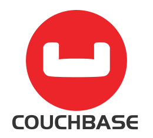
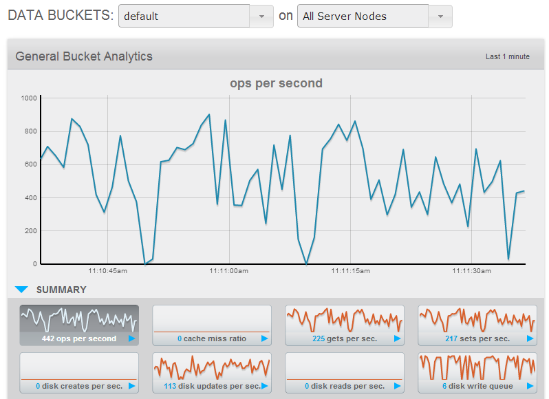

# Introduction

# Ortus Couchbase Extension

> Couchbase Server is a distributed NoSQL document database for interactive applications. Its scale-out architecture runs in the cloud or on commodity hardware and provides a flexible data model, consistent high-performance, easy scalability and always-on 24x365 availability. Thanks to a flexible JSON model, Couchbase Server makes it easy to modify your applications without the constraints of a fixed database schema. Submillisecond, high-throughput reads and writes give you consistent high performance. Couchbase Server is easy to scale out, and supports topology changes with no downtime. [Couchbase Inc.](http://www.couchbase.com/).

 

Couchbase Web Dashboard showing bucket usage via Lucee Extension

## Requirements

* Lucee 5.1.0 and above
* Couchbase 4.5 and above (Community or Enterprise)

## Features In A Nutshell {#features_in_a_nutshell}

* Add Couchbase functionality to any Lucee application
* Install at the web context level or the server level (Available to
    all contexts)
* Create Cache connections in the Lucee web administrator or via
    ``{=html}Application.cfc``{=html}
    to connect to any network-accessable Couchbase cluster
* Set and get objects from Couchbase via standard CFML functions and
    tags (cachePut(), cacheGet(), \<cfcache action=\"get\|put\"\>)
* Fully supports all built-in Lucee cache functions including wildcard
    filters
* Seamlessly distribute storage of the following to any bucket in a
    Couchbase cluster
  * Lucee session storage
  * Lucee client storage
  * Lucee Ram resouce (ram://\...)
* Seamlessly cache the following to any timeout-sensitive bucket in a
    Couchbase cluster
  * Results of database queries
  * Results of deterministic functions
  * Complex or simple objects in your application\'s code
  * Cached templates (\<cfcache
        action=\"content\|cache\|serverCache\"\>)
* Extremely lightweight and fast

### Support

The Ortus Couchbase Extension is a commercial product by Ortus Solutions. If you have purchased a license then you are entitled to customer support. You can either visit our support page to contact us or create an issue in our bug tracker.

* Support Page: [https://www.ortussolutions.com/services/support](https://www.ortussolutions.com/services/support)
* Bug Tracker: [https://ortussolutions.atlassian.net/browse/LRE](https://ortussolutions.atlassian.net/browse/LRE)
