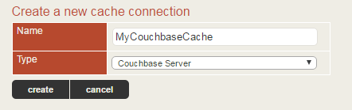
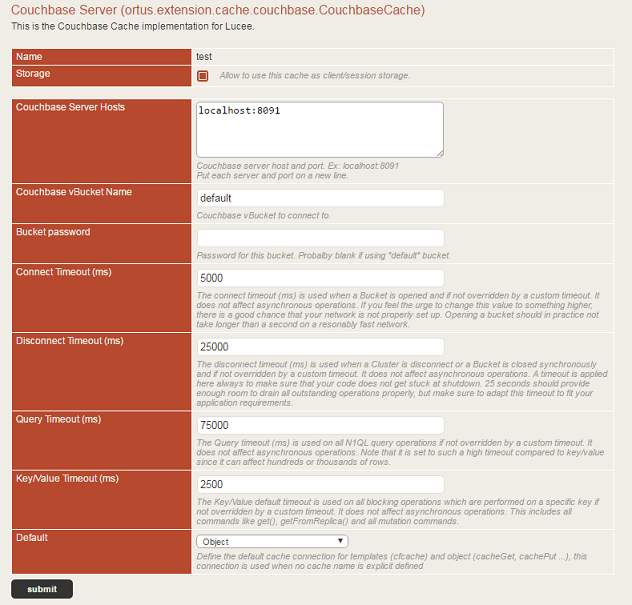

## Configuration

If you install the Extension in the Server Administrator, you will be able to create server-level caches as well as site-specific caches in each of the Web Administrators. If you install the extension in a web administrator, you will only be able to create Couchbase caches for that site. We recommend installing the extension in the Server Administrator so it is available to all the websites under that same Lucee installation.

To add a new cache, click on **Services \> Cache** and you should see a list of existing caches. If there are no existing caches, you should be taken straight to the **create** screen. Type a *name* for this cache connection and choose **Couchbase Server** from the **type** dropdown and click **create**.



### Create a new cache

You will then be taken to a page of options for the Couchbase Cache
implementation. Check the **Storage** box if you want to be able to use
this cache for session or client storage distribution. Enter the
Couchbase server IP addresses or host names in the text area one per
line. If you have many servers in your Couchbase cluster, you only need
to list a few of them here. The client library will do auto discovery of
the rest of the nodes once it connects. Enter your bucket name and
password.

```{=html}
<div class="alert alert-info">
```
**Important**: If you are using the default bucket, there will be no
password required.

```{=html}
</div>
```
The **Default** dropdown allows you to specify this connection to be
used as the default storage mechanism for function, object, template,
query, or resource caches in Lucee. If you set this at the server level,
it can be overridden at the website level. Click **Submit** to finish
creating the cache connection and save its settings.

```{=html}
<div class="well well-small text-center">
```


Cache settings

Here\'s an overview of all the settings available to you on a
cache-by-cache basis:

| **Setting**                   | **Type**    | **Default**      | **Description** |
| ----------------------------- | ----------- | ---------------- | --------------- |
| **Storage**                   | yes/no      | no               | Allow to use this cache as client/session storage. |
| **Couchbase Server Hosts**    | Text area   | localhost:8091   | Couchbase server host and port. Put each server and port on a new line. |
| **Couchbase vBucket Name**    | Text        | default          | Couchbase vBucket to connect to. |
| **Username**           | Text        | \-\--            | Username for authentication.  Defaults to the bucket name. |
| **Password**           | Text        | \-\--            | Password for this bucket or for the user account. Blank if using \"default\" bucket on older versions of Couchbase. |
| **Connect Timeout (ms)**      | Number      | 5000             | The connect timeout (ms) is used when a Bucket is opened and if not overridden by a custom timeout. It does not affect asynchronous operations. If you feel the urge to change this value to something higher, there is a good chance that your network is not properly set up. Opening a bucket should in practice not take longer than a second on a resonably fast network. |
| **Disconnect Timeout (ms)**   | Number      | 25000            | The disconnect timeout (ms) is used when a Cluster is disconnect or a Bucket is closed synchronously and if not overridden by a custom timeout. It does not affect asynchronous operations. A timeout is applied here always to make sure that your code does not get stuck at shutdown. 25 seconds should provide enough room to drain all outstanding operations properly, but make sure to adapt this timeout to fit your application requirements. |
| **Query Timeout (ms)**        | Number      | 75000            | The Query timeout (ms) is used on all N1QL query operations if not overridden by a custom timeout. It does not affect asynchronous operations. Note that it is set to such a high timeout compared to key/value since it can affect hundreds or thousands of rows. |
| **Key/Value Timeout (ms)**    | Number      | 2500             | The Key/Value default timeout is used on all blocking operations which are performed on a specific key if not overridden by a custom timeout. It does not affect asynchronous operations. This includes all commands like get(), getFromReplica() and all mutation commands. |
| **Default**                   | Dropdown    | \-\--            | Define the default cache connection for Function, Object, Template, Query, or Resource caches. |


## CFConfig Connections

You can also leverage a `cfconfig.json` file to store the cache configurations and automatically load them into your CFML server via CommandBox.

```javascript
{
    "caches":{
        "sessions": {
            "class":"ortus.extension.cache.couchbase.CouchbaseCache",
            "custom":{
                "connectTimeout":"5000",
                "queryTimeout":"75000",
                "bucketName":"revagency-pricemind-data",
                "disconnectTimeout":"25000",
                "kvTimeout":"2500",
                "username":"${COUCHBASE_USERNAME}",
                "password":"${COUCHBASE_PASSWORD}",
                "hosts":"${COUCHBASE_HOST1}\r\n${COUCHBASE_HOST2}\r\n${COUCHBASE_HOST3}"
            },
            "readOnly":"false",
            "storage":"true"
        }
    },
    "inspectTemplate":"always",
    "requestTimeout":"0,0,0,50",
    "sessionMangement":"yes",
    "sessionTimeout":"0,0,30,0"
}
```

Please refer to the previous section to find out about what the custom options mean.