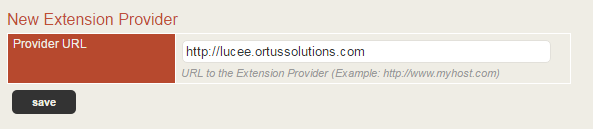

# Installation

## Couchbase Setup

You will need to install Couchbase Server separately. Your Couchbase cluster can be a single node, or multiple nodes. The nodes can be installed along side your web servers, or on a server farm of their own - it's entirely up to you. The recommended setup would be to have at least **3** dedicated machines (even if virtual) with several Gigs of RAM availble to Couchbase.

3 Couchbase servers is the minimum required for auto-failover to work when employing a single replica configuration. You will need to determine the durability needs of your Couchbase setup or you can contact us at <consulting@ortussolutions.com> so we can help you build your Couchbase Farm.

## Lucee Setup

The Couchbase extension is installed as a Lucee extension into any Lucee Server version `5.1.0` and above. The extension can either be installed in the server context or a specific web context.

### Server Context

If installed in the server context, you can create server-level caches that are available to all web contexts in Lucee. The driver will also be availble to all web contexts to add their own local caches or override caches if they need to.

### Web Context

If the extension is installed in a specific web context, the Couchbase drivers will be available only to that context and not usable by any other web context on the server. Any other web contexts that want to use Couchbase would need to specifically install the extension as well.

### Recommended Setup

The recommended setup is to install the extension at the **server** level. If you have a cache that all contexts will share like session storage, you could create a cache in each web context that points to the same Couchbase bucket, but it is recommended to create that cache once at the server level and let all sites inherit it.

If you have a cache that is only going to be used for one site, it is recommended you create that cache in the web context for that site only.

**Important**: You can create multiple named Lucee caches that point to the same Couchbase bucket. To reduce confusion, try not to do this unless you have a good reason. A reason could be that you want one application to have a different operation timeouts.

### Add Extension Provider

In your Lucee Administrator under **Extension \> Providers** paste in your Ortus provider URL (http://lucee.ortussolutions.com) and click
**save**.

Adding Extension Provider

One added, the new provider URL should show up in the list as verified.

Ortus Extension Provider Added

### Installing the Extension

Now click **Extensions \> Applications** and wait for the list to load. There should be a item in the list called **Ortus Couchbase Cache**. You can activate it as a trial or as a full version with a license key after you install.

Extension in the list of not installed items

Click it and then click the **install** button to begin the installation process.

Extension details

### Activating the Extension {#activating_the_extension}

Once the extension installs, you will now see a new menu item in the admin called \"Ortus\" with a sub menu called \"Couchbase Cache\". Click this menu and you\'ll see the activation screen where you can enter the **license key** and **license email** with which you purchased the extension with. You will also have to determine the type of server you are installing the extension to. Development or non-public facing servers are FREE of charge and by default receive up to 4 activations. Production servers get only 1 activation, so make sure you choose the right server type. Once you get all your information in the form then click on the **activate** button to finalize the installation. Choose the trial option if you don\'t have a license and just want to try out the extension. When the trial expires, the cache provider will stop working! The trial is not for production use.

**Note** : Development and staging servers are FREE of charge and each license includes up to 4 activations. Production licenses are on a per Lucee instance and are allowed 1 activation. If you have any activation issues please contact us at <support@ortussolutions.com>. Also, make sure you havea valid internet connection in order to activate your product.

Extension Activation

The Ortus Lucee Couchbase Extension should now be installed on your server and ready to use. We highly recommend you restart your entire servlet container (Tomcat/Resin/jetty/etc) in order for all Jar files to take effect. Make sure your Couchbase cluster is running and proceed on to the next step\-- creating a cache.

**Important**: Please note that the Couchbase Extension is licensed on a per-JVM basis. You will need a
license for each separate JVM, regardless of how many contexts (sites) are deployed in your Lucee installation. The typical setup is one JVM per physical/virtual server. Please [ask us](mailto:consulting@ortussolutions.com) if you have licensing questions.
